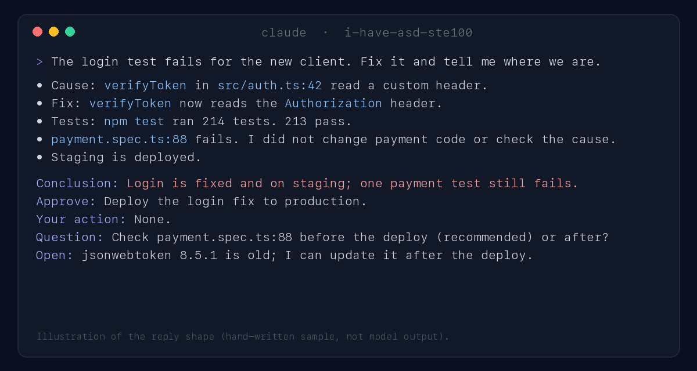

<p align="center">
  
</p>

<h1 align="center">i-have-asd-ste100</h1>

<p align="center">
  <strong>Your coding agent writes like a good engineer reports: short body, conclusion last, in any language.</strong>
</p>

<p align="center">
  <a href="https://github.com/hiendang7613/i-have-asd-ste100/actions/workflows/ci.yml"></a>
  <a href="LICENSE"></a>
  
  
  
  
</p>

<p align="center">
  
</p>

Long agent replies hide the one thing you need: what failed, what needs your OK, what is left.
This plugin gives every reply the same shape. The facts come first, in short sentences.
A five-line conclusion block always closes the reply, so your eye knows where to look.

## Install in 30 seconds

Paste this into Claude Code or Codex:

```text
Install the i-have-asd-ste100 plugin from https://github.com/hiendang7613/i-have-asd-ste100 and follow its INSTALL.md.
```

Or by hand:

```bash
# Claude Code
claude plugin marketplace add hiendang7613/i-have-asd-ste100
claude plugin install i-have-asd-ste100@i-have-asd-ste100

# Codex
codex plugin marketplace add hiendang7613/i-have-asd-ste100
codex plugin add i-have-asd-ste100@i-have-asd-ste100
```

Restart. Every new session now uses the shape. There is nothing to turn on. Details and Codex steps: [INSTALL.md](INSTALL.md).

## One task, three replies

Task: *"The login test fails for the new client. Fix it and tell me where we are."*
All three replies carry the same six facts. They are illustrative: written by hand from each project's published rules, not generated by a model.

<table>
<tr><th width="33%">Default agent (169 words, excerpt)</th><th width="33%"><a href="https://github.com/ayghri/i-have-adhd">i-have-adhd</a> (88 words)</th><th width="34%">i-have-asd-ste100 (103 words)</th></tr>
<tr valign="top">
<td>

Great question! I looked into the failing login test, and it turns out the problem was in how the token verification function in the auth module read the token: `verifyToken` in `src/auth.ts:42` was reading a custom header, while the new client sends the standard `Authorization: Bearer <token>` header, so its requests were rejected with a 401 even with a valid token. I updated `verifyToken` ... 213 of the 214 tests pass now. The one that still fails is `payment.spec.ts:88`, but I didn't touch any payment code, so it is probably unrelated ... production is ready to go whenever you approve it. By the way, ... Hope this helps!

</td>
<td>

Next: approve the production deploy, or tell me to check `payment.spec.ts:88` first.

Login works for the new client now: `verifyToken` (`src/auth.ts:42`) reads the `Authorization: Bearer <token>` header.

1. `npm test`: 213 of 214 pass.
2. `payment.spec.ts:88` fails. I did not change payment code and did not check the cause.
3. Staging is deployed.

Step 3 of 4 done. Production deploy waits for your approval.

Separately: `jsonwebtoken` 8.5.1 is old. Want me to update it after this?

Next: reply "deploy" or "check payment first".

</td>
<td>

- Cause: `verifyToken` in `src/auth.ts:42` read a custom header. The new client sends `Authorization: Bearer <token>`.
- Fix: `verifyToken` now reads the `Authorization` header.
- Tests: `npm test` ran 214 tests. 213 pass.
- `payment.spec.ts:88` fails. I did not change payment code, and I did not check the cause.
- Staging is deployed.

**Conclusion:** Login is fixed and on staging; one payment test still fails, cause not checked.<br>
**Approve:** Deploy the login fix to production.<br>
**Your action:** None.<br>
**Question:** Check `payment.spec.ts:88` before the deploy (recommended) or after it?<br>
**Open:** `jsonwebtoken` 8.5.1 is old; I can update it after the deploy.

</td>
</tr>
</table>

What the comparison shows:

- **i-have-adhd is shorter and starts with the next action.** That is the right shape when the reader's problem is starting.
- **i-have-asd-ste100 puts every decision in a fixed, labeled place.** The approval, the question and the follow-up are separate lines, never mixed into one "Next".
- **In a long agent session, the fixed labels are scannable.** `grep "Approve:"` finds every pending approval across fifty replies; in free-form replies, approvals hide inside sentences.
- **Bad news stays in the conclusion line.** The default reply calls the failing test "probably unrelated"; the conclusion here says "cause not checked".

Full texts: [examples/compare/](examples/compare/).

## The shape

| Line | What it holds |
|---|---|
| **Conclusion** | The result in one sentence. Bad news first: failure, skip, blocker, unverified work. |
| **Approve** | What needs your approval. |
| **Your action** | What only you can do. |
| **Question** | One question, with options and the recommended one marked. |
| **Open** | Work still open, and who owns it. |

Each line is one sentence. If nothing else is open, only the Conclusion line appears. One-fact answers stay one sentence.
Exact-output requests (only code, only JSON, one command) get exactly that, with no block.

## Any language

The agent writes the five labels in your language and keeps them identical for the whole session.
The rules themselves name no language, so they never pull a reply into English.
Sentence length is measured in words for languages with spaces and in characters for Chinese, Japanese and Thai.

| Language | Conclusion · Approve · Your action · Question · Open | Full reply |
|---|---|---|
| English | Conclusion · Approve · Your action · Question · Open | [after-en.md](examples/after-en.md) |
| Tiếng Việt | Chốt · Cần duyệt · Bạn cần làm · Câu hỏi · Việc còn mở | [after-vi.md](examples/after-vi.md) |
| 中文 | 结论 · 需要批准 · 你需要做 · 问题 · 待办 | [after-zh.md](examples/after-zh.md) |
| 日本語 | 結論 · 承認 · あなたの作業 · 質問 · 未完了 | [after-ja.md](examples/after-ja.md) |
| Español | Conclusión · Aprobar · Tu acción · Pregunta · Pendiente | [after-es.md](examples/after-es.md) |

These examples were written by the maintainers, not by native speakers of every language.
Native speakers: [fix or add your language](.github/ISSUE_TEMPLATE/language.yml). It is the best first contribution.

## i-have-adhd and i-have-asd-ste100 side by side

| | i-have-adhd | i-have-asd-ste100 |
|---|---|---|
| Best for | Starting the next action | Decisions, approvals and status in long agent sessions |
| Reply shape | Next action first, numbered steps, one next step at the end | Short body, then a fixed five-line conclusion block |
| Turned on | By command; always-on with an opt-in flag | On by default after install; opt-out file or "stop ste mode" |
| Drift control | Rules injected at session start | Session start plus a one-line reminder on every prompt |
| Languages | Rules in English; README in 10 languages | Language-neutral rules; labels in the user's language; examples in 5 languages |
| Runtimes | Claude Code, Codex, Cursor, Gemini, OpenCode, Pi, Qwen, Kimi | Claude Code, Codex |
| Offline checker | No | `scripts/check_reply.py`: block, line length, openers, closers |
| Measured evidence | Blind LLM-judge A/B: 14 cases, 3 trials, weighted score 4.045 to 4.473 | 10 eval cases written; not run yet, so no numbers are claimed |

Both are MIT. Use the one that matches your problem, or read both rule sets: they agree on more than they differ.

## How it works

1. **SessionStart hook:** injects the rules ([SKILL.md](skills/i-have-asd-ste100/SKILL.md)) into every new session.
2. **UserPromptSubmit hook:** adds one reminder line to each prompt, because models drift in long sessions.
3. **Your words win:** "stop ste mode" turns it off for the session; "ste mode" turns it on again.
4. **Exact output wins:** code-only, JSON-only and single-command requests are never wrapped.

The hooks never block a session. On any error they exit quietly. They make no network call.

## Cost

About 1,800 tokens of rules at session start (the `claude plugin details` estimate) and about 80 tokens per prompt for the reminder line.
`claude plugin details i-have-asd-ste100` shows the projection for your setup.

## FAQ

**Is this ASD-STE100 certified?** No. It borrows general principles of Simplified Technical English: short sentences, one idea each, one term per concept. It ships no specification text or dictionary, and it is not affiliated with ASD.

**Does it change the agent's reasoning, code or files?** No. It shapes the reply text you read.

**Will it break JSON or command output?** No. Exact-output requests get exactly that output.

**Can I check a reply offline?** Yes: `python3 scripts/check_reply.py reply.md`. It counts shape and length; it cannot judge whether the reply is true.

## Evidence, honestly

No public project in this space has measured human comprehension. i-have-adhd has the best evidence: a blind LLM-judge A/B.
This repository has ten eval cases for `claude plugin eval` in [evals/](evals/). They have not run yet, so this README claims no scores.
The research notes behind the rules are summarized in [docs/RESEARCH.md](docs/RESEARCH.md).

## Made for Agent Room

[Agent Room](https://github.com/hiendang7613/agent-room-plugin) runs a small team of Claude Code and Codex agents in your project:
shared tasks, peer messages, reviews and recovery after a crash. One agent talks to you; the others report through it.
With i-have-asd-ste100 installed, every report you get from the room has the same shape, so a busy room stays readable.
Agent Room is adding i-have-asd-ste100 as an install dependency (in progress).

## Contributing and license

Start with [CONTRIBUTING.md](CONTRIBUTING.md). MIT licensed; see [LICENSE](LICENSE) and [licenses/NOTICE.md](licenses/NOTICE.md).
Inspired by [i-have-adhd](https://github.com/ayghri/i-have-adhd) by Ayoub Ghriss.
