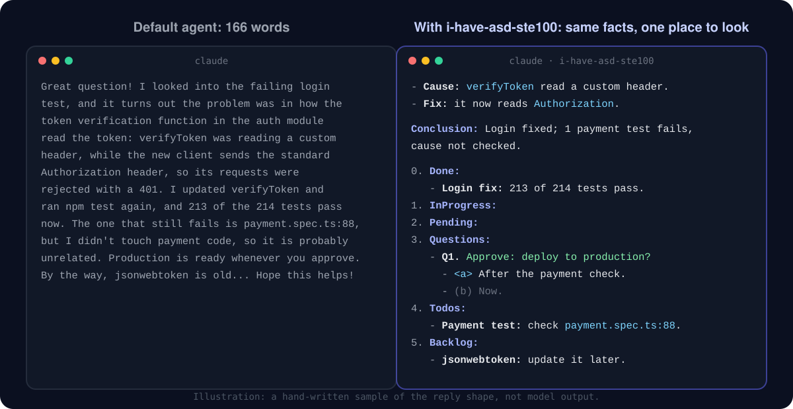

<p align="center">
  
</p>

<h1 align="center">i-have-asd-ste100</h1>

<p align="center">
  <strong>Agent replies you can read in five seconds.</strong><br>
  Short body. Five fixed lines at the end. Any language.
</p>

<p align="center">
  <a href="https://github.com/hiendang7613/i-have-asd-ste100/actions/workflows/ci.yml"></a>
  <a href="LICENSE"></a>
  
  
  
</p>

<p align="center">
  
</p>

<p align="center">
  <a href="#install">Install</a> ·
  <a href="#shape">The shape</a> ·
  <a href="#format">Format</a> ·
  <a href="#compare">Compare</a> ·
  <a href="#languages">Languages</a> ·
  <a href="#faq">FAQ</a>
</p>

Coding agents bury the one thing you need: what failed, what needs your OK, what is left.
This plugin gives every reply the same shape. Facts come first, one per line. Five fixed lines close the reply.
Your eye learns where to look, in every session and in every language.

<a name="install"></a>

## ⚡ Install in 30 seconds

Paste this into Claude Code or Codex:

```text
Install the i-have-asd-ste100 plugin from https://github.com/hiendang7613/i-have-asd-ste100 and follow its INSTALL.md.
```

Or by hand:

```bash
# Claude Code: on by default after a restart
claude plugin marketplace add hiendang7613/i-have-asd-ste100
claude plugin install i-have-asd-ste100@i-have-asd-ste100

# Codex: loads the skill; see INSTALL.md to make it the default
codex plugin marketplace add hiendang7613/i-have-asd-ste100
codex plugin add i-have-asd-ste100@i-have-asd-ste100
```

Nothing to turn on. Say `stop ste mode` to pause it for a session. Details: [INSTALL.md](INSTALL.md).

<a name="shape"></a>

## 🧭 The shape

Every reply ends with the same five list items. The icons stay the same in every language, so the block is easy to find.

| Line | What it holds |
|---|---|
| 🎯 **Conclusion** | The result in one sentence. Bad news first: failure, skip, blocker, unverified work. |
| 🔑 **Approve** | What needs your approval. |
| 👉 **Your action** | What only you can do. |
| ❓ **Question** | One question, with options and the recommended one marked. |
| 📌 **Open** | Work still open, and who owns it. |

If nothing else is open, only 🎯 appears. A one-fact answer stays one sentence.
When you ask for only code, only JSON or one command, you get exactly that, with no block.

<a name="format"></a>

## ✨ Format for fast reading

| Element | Rule | Why |
|---|---|---|
| Bullets | Each line starts with its key: a **bold word**, a `path`, or one status icon | You read the first two words of a line, then decide |
| Status icons | ✅ done and checked · ❌ failed · ⏳ waiting or running, always followed by words | Shape and color are seen before words; the words keep the meaning when icons do not render |
| Code spans | Paths, commands, IDs, settings and errors only | Exact strings stay exact and stand out |
| Bold | Block labels, plus at most one phrase per bullet | Emphasis that is everywhere is nowhere |
| Tables | Only to compare three or more items | Terminals wrap wide tables |
| Headings and boxes | Not in normal replies | They cost lines and break in narrow terminals |
| Sentences | One idea each; about 20 words, or the same reading time in your language | Short sentences survive translation and fatigue |

All eight icons are single wide characters (East Asian Width "W"), so they keep terminal columns aligned. No variation selectors.

<a name="compare"></a>

## ⚖️ One task, three replies

Task: *"The login test fails for the new client. Fix it and tell me where we are."* All three replies keep the same six facts.

| | Default agent | [i-have-adhd](https://github.com/ayghri/i-have-adhd) | i-have-asd-ste100 |
|---|---|---|---|
| Words (markup not counted) | 166 | 82 | 95 |
| Longest sentence | 57 words | 18 words | 15 words |
| Where the approval is | Mid-paragraph | First and last line ("Next:") | Its own line: 🔑 Approve |
| The failing test in the summary | "probably unrelated" | Inside a numbered step | 🎯 line: "cause not checked" |

The samples are illustrative: written by hand from each project's published rules, not generated by a model.

<details>
<summary><strong>Read the three replies</strong></summary>

**Default agent (excerpt)**

> Great question! I looked into the failing login test, and it turns out the problem was in how the token verification function in the auth module read the token ... The one that still fails is `payment.spec.ts:88`, but I didn't touch any payment code, so it is probably unrelated ... Hope this helps!

**i-have-adhd**

> Next: approve the production deploy, or tell me to check `payment.spec.ts:88` first.
>
> Login works for the new client now: `verifyToken` (`src/auth.ts:42`) reads the `Authorization: Bearer <token>` header.
>
> 1. `npm test`: 213 of 214 pass.
> 2. `payment.spec.ts:88` fails. I did not change payment code and did not check the cause.
> 3. Staging is deployed.
>
> Step 3 of 4 done. Production deploy waits for your approval. Next: reply "deploy" or "check payment first".

**i-have-asd-ste100**

> - **Cause:** `verifyToken` in `src/auth.ts:42` read a custom header. The new client sends `Authorization: Bearer <token>`.
> - **Fix:** `verifyToken` now reads the `Authorization` header.
> - ✅ **Tests:** `npm test` ran 214 tests. 213 pass.
> - ❌ `payment.spec.ts:88` fails. I did not change payment code, and I did not check the cause.
> - **Staging** is deployed.
>
> - 🎯 **Conclusion:** Login is fixed and on staging; one payment test still fails, cause not checked.
> - 🔑 **Approve:** Deploy the login fix to production.
> - 👉 **Your action:** None.
> - ❓ **Question:** Should I check `payment.spec.ts:88` before the production deploy (recommended) or after it?
> - 📌 **Open:** `jsonwebtoken` 8.5.1 is old; I can update it after the deploy.

Full files: [examples/compare/](examples/compare/).
</details>

**What it means for you:** i-have-adhd is shorter and starts with the next action, which helps when the hard part is starting.
i-have-asd-ste100 puts every decision on a fixed, labeled line, which helps when you review many agent reports in a row:
`grep "🔑"` finds every pending approval in a session log, in any language.

<a name="languages"></a>

## 🌍 Any language

The agent writes the labels in your language and keeps them identical for the session. The icons never change.
The rules name no language, so they never pull a reply into English.

| Language | 🎯 · 🔑 · 👉 · ❓ · 📌 | Example |
|---|---|---|
| English | Conclusion · Approve · Your action · Question · Open | [after-en.md](examples/after-en.md) |
| Tiếng Việt | Chốt · Cần duyệt · Bạn cần làm · Câu hỏi · Việc còn mở | [after-vi.md](examples/after-vi.md) |
| 中文 | 结论 · 需要批准 · 你需要做 · 问题 · 待办 | [after-zh.md](examples/after-zh.md) |
| 日本語 | 結論 · 承認 · あなたの作業 · 質問 · 未完了 | [after-ja.md](examples/after-ja.md) |
| Español | Conclusión · Aprobar · Tu acción · Pregunta · Pendiente | [after-es.md](examples/after-es.md) |

Sentence length is measured in words where words have spaces, and in characters for Chinese and Japanese (about 1.5 characters per English word).
The maintainers wrote these examples. Native speakers: [fix or add your language](.github/ISSUE_TEMPLATE/language.yml).

## 🆚 i-have-adhd and i-have-asd-ste100

| | i-have-adhd | i-have-asd-ste100 |
|---|---|---|
| Best for | Starting the next action | Decisions, approvals and status across many agent reports |
| Reply shape | Next action first, numbered steps, one next step at the end | Key-first bullets, then five fixed lines with icons |
| Turned on | By command; always-on with an opt-in flag | On by default after install; `stop ste mode` or an opt-out file |
| Drift control | Rules at session start | Session start plus one reminder line per prompt |
| Languages | Rules in English; README in 10 languages | Language-neutral rules; labels in your language; examples in 5 languages |
| Runtimes | Claude Code, Codex, Cursor, Gemini, OpenCode, Pi, Qwen, Kimi | Claude Code, Codex |
| Offline checker | No | `scripts/check_reply.py`: block, icons, line length, any script |
| Measured evidence | Blind LLM-judge A/B: 14 cases, 3 trials, 4.045 to 4.473 | 10 eval cases written; not run yet, so no scores are claimed |

Both are MIT. They agree on more than they differ; pick the one that matches your problem.

## ⚙️ How it works

1. **Session start:** a hook injects the rules ([SKILL.md](skills/i-have-asd-ste100/SKILL.md), under 6.5 KB).
2. **Every prompt:** one reminder line keeps long sessions from drifting.
3. **Your words win:** `stop ste mode` pauses it; `ste mode` resumes; `no icons` drops the icons.
4. **Exact output wins:** code-only, JSON-only and single-command requests are never wrapped.
5. **Safe by design:** the hooks never block a session, make no network call, and stay silent on any error.

## 💸 Cost

About 1,800 tokens at session start and about 90 tokens per prompt. Run `claude plugin details i-have-asd-ste100` for your setup.

<a name="faq"></a>

## ❓ FAQ

<details><summary><strong>Is this ASD-STE100 certified?</strong></summary>

No. It borrows general principles of Simplified Technical English and plain-language guidance: short sentences, one idea each, one term per concept. It ships no specification text or dictionary and is not affiliated with ASD.
</details>

<details><summary><strong>Does it change the agent's reasoning, code or commits?</strong></summary>

No. It shapes only the text you read at the end of a turn. Code, commits, pull request bodies, files and messages to other agents keep their own format.
</details>

<details><summary><strong>My terminal shows boxes instead of icons.</strong></summary>

Say `no icons`. Every icon is followed by words, so nothing is lost.
</details>

<details><summary><strong>Can I check a reply offline?</strong></summary>

Yes: `python3 scripts/check_reply.py reply.md`. It checks the shape, the icons and the length in any script. It cannot judge whether a reply is true.
</details>

## 🔬 Evidence, honestly

No public project in this space has measured human comprehension. i-have-adhd has the best evidence so far: a blind LLM-judge A/B.
This repository has ten eval cases for `claude plugin eval` in [evals/](evals/). They have not run yet, so this README claims no scores.
The research behind each rule, with sources and strength ratings, is in [docs/RESEARCH.md](docs/RESEARCH.md).

## 🤝 Made for Agent Room

[Agent Room](https://github.com/hiendang7613/agent-room-plugin) runs a small team of Claude Code and Codex agents in your project:
shared tasks, peer review and recovery after a crash. One agent talks to you; the others report through it.
With i-have-asd-ste100 installed, every report from the room has the same shape. Agent Room plans to add it as an install dependency.

## Contributing and license

Start with [CONTRIBUTING.md](CONTRIBUTING.md). The best first contribution is [your language](.github/ISSUE_TEMPLATE/language.yml).
MIT licensed; see [LICENSE](LICENSE) and [licenses/NOTICE.md](licenses/NOTICE.md). Inspired by [i-have-adhd](https://github.com/ayghri/i-have-adhd) by Ayoub Ghriss.
